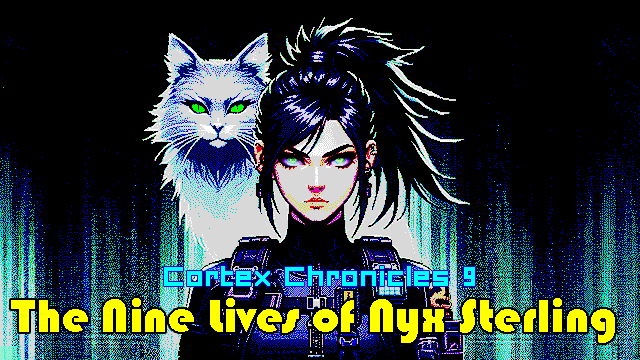
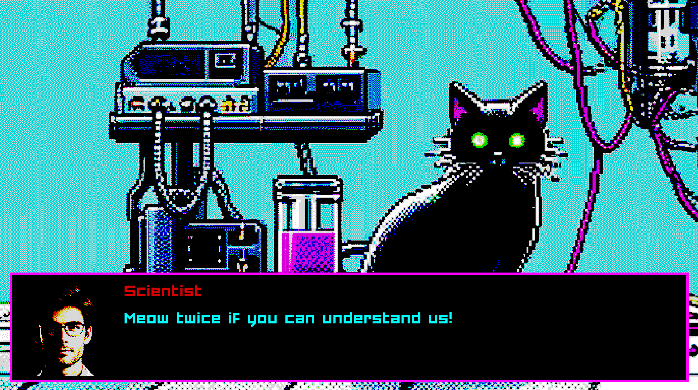
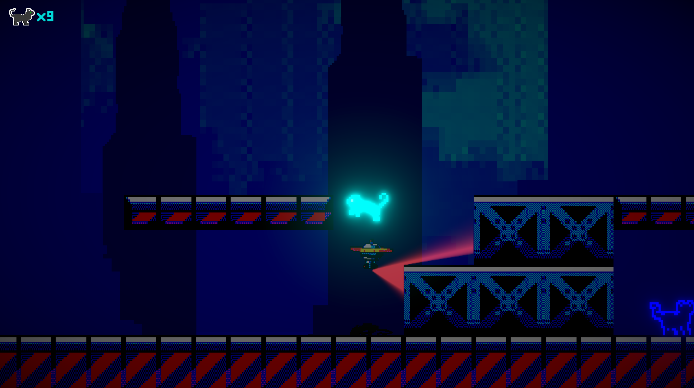
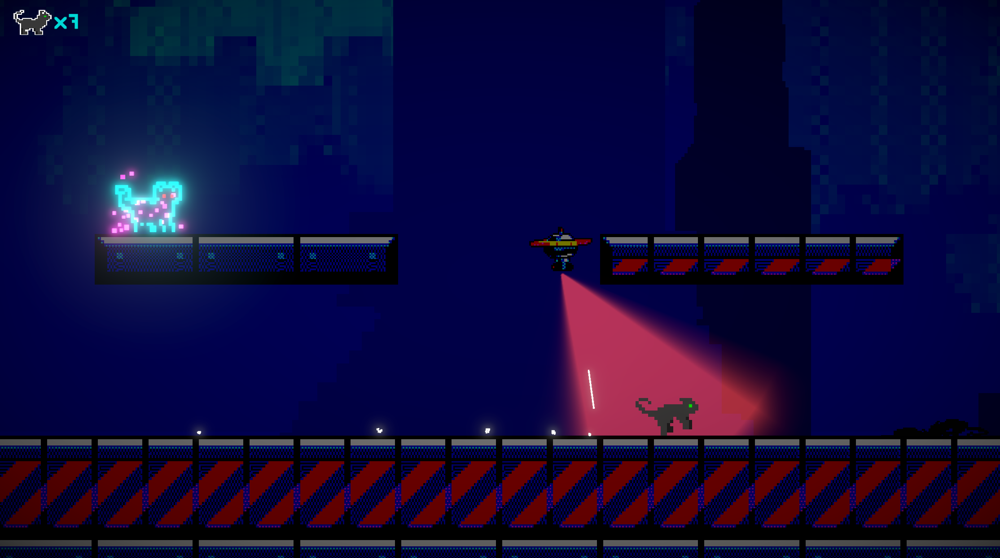

# THE CORTEX CHRONICLES, CHAPTER 9 - The Nine Lives of Nyx Sterling

Developed for the Game Creator's Club at Lusofona University.
This month, the theme is Cats

This is a part of what I hope will be "The Cortex Chronicles" - I want all the games I do for the Game Creator's Club this year to be linked together, hence this idea.
I also want to use a different engine on every entry, so let's see how that goes! :)

Started with the [Defold](https://defold.com/) engine, but there are too little teaching resources, and the whole messaging system makes everything more complicated and less enjoyable.
Because of that, decided to switch back to Unity and make the game there... I'm failing my "different engine every GCC" challenge, but I don't fail the "a game every GCC" challenge, which is more important! 

But, if we want to get creating with it, I'm using Unity 6 preview, so that kind of qualified as a new engine... :)

## Game

In this game, you take the role of Nyx Sterling.
After the resistance retrieved a nuke to generate an EMP pulse, they need to smuggle it on board the space station where the Prime Nexus rules the earth.
Security is extremely high now, since a rogue nuke is on the loose, so the only way the nuke is making it past spaceport security is by having someone on the inside. After months of failing, the resistance is no closer to penetrating security. So, an insane plan is formulated!

Since a human can't infiltrate the spaceport, maybe an animal will! Using experimental technology, the consciousness of Nyx is transfered to a cat, and now she has to penetrate the facility to authorize the passage of the nuke...

## Gameplay 

Usual platformer controls apply. An interesting mechanic that I'd like to explore further is that instead of a health system, this game features a probability system. All shots have a certain possibility of killing the player character. This probability grows if many shots hit nearby, and lessens if the player keeps moving, etc.
The overal result is interesting. It really can heighten the stress of circumstances, especially if we force the conflict, that is, if we don't let the player avoid all battles. 
But on the other hand there's the issue of how to communicate to the player that this is happening (it's not very intuitive compared to a health display), and if we simplify this, this is basically a regenerating health bar with the possibility of insta-death.

## Art

- Cat sprites by [Shepardskin](https://opengameart.org/users/shepardskin), licensed through the [CC0] license.
- Drone sprites by [Craftpix], free to use through [own](https://craftpix.net/file-licenses/) license
- Industrial tileset by [Craftpix], free to use through [own](https://craftpix.net/file-licenses/) license
- Font [Forced Square] by Friendly Fonts, free for personal use.
- Everything else done by [Diogo de Andrade], licensed through the [CC0] license.

## Sound

- Main game music by [Migfus20], licensed through the [CC0] license.
- Logo music by [João Camacho], licensed to Spellcaster Studios
- Title music by [awrmacd], licensed through the [CC0] license.
- Shot by [pgi], licensed through the [CC0] license.
- Thump by [TechGeekMusic], licensed through the [CC0] license.
- Ricochet by [cedarstudios], licensed through the [CC0] license.
- Alarm sound by [jobro], licensed through the [CC0] license.
- Meow sound by [tuberatanka](https://freesound.org/people/tuberatanka/), licensed through the [CC0] license.

## Code

- Some code was adapted/refactored from [Okapi Kit], licensed under the [MIT] license.
- All remaining game source code by Diogo de Andrade is licensed under the [MIT] license.

## Metadata

- Autor: [Diogo de Andrade]

[Diogo de Andrade]:https://github.com/DiogoDeAndrade
[CC0]:https://creativecommons.org/publicdomain/zero/1.0/
[CC-BY 3.0]:https://creativecommons.org/licenses/by/3.0/
[CC-BY-SA 4.0]:http://creativecommons.org/licenses/by-sa/4.0/
[MIT]:LICENSE
[Craftpix]:https://craftpix.net
[Okapi Kit]:https://github.com/VideojogosLusofona/OkapiKit
[Forced Square]:https://www.dafont.com/pt/forced-square.font