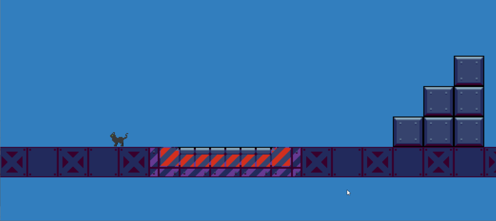

# THE CORTEX CHRONICLES, CHAPTER 9 - The Nine Lives of Nyx Sterling

Developed for the Game Creator's Club at Lusofona University.
This month, the theme is Cats

This is a part of what I hope will be "The Cortex Chronicles" - I want all the games I do for the Game Creator's Club this year to be linked together, hence this idea.
I also want to use a different engine on every entry, so let's see how that goes! :)

Started with the [Defold](https://defold.com/) engine, but there are too little teaching resources, and the whole messaging system makes everything more complicated and less enjoyable.
Because of that, decided to switch back to Unity and make the game there... I'm failing my "different engine every GCC" challenge, but I don't fail the "a game every GCC" challenge, which is more important! 

But, if we want to get creating with it, I'm using Unity 6 preview, so that kind of qualified as a new engine... :)

## Todo

* UI (9 lives...)
* Guards that search
* Guards that shoot
* Storytelling elements
* Level design
* Secret level!

## Art

- Cat sprites by [Shepardskin](https://opengameart.org/users/shepardskin)
- Drone sprites by [Craftpix]
- Industrial tileset by [Craftpix]
- Everything else done by [Diogo de Andrade], licensed through the [CC0] license.

## Sound

## Code

- Some code was adapted/refactored from [Okapi Kit], licensed under the [MIT] license.
- All remaining game source code by Diogo de Andrade is licensed under the [MIT] license.

## Metadata

- Autor: [Diogo de Andrade]

[Diogo de Andrade]:https://github.com/DiogoDeAndrade
[CC0]:https://creativecommons.org/publicdomain/zero/1.0/
[CC-BY 3.0]:https://creativecommons.org/licenses/by/3.0/
[CC-BY-SA 4.0]:http://creativecommons.org/licenses/by-sa/4.0/
[MIT]:LICENSE
[Craftpix]:https://craftpix.net
[Okapi Kit]:https://github.com/VideojogosLusofona/OkapiKit